<h1 align="center">Tablefinder Restaurant</h1>

 

 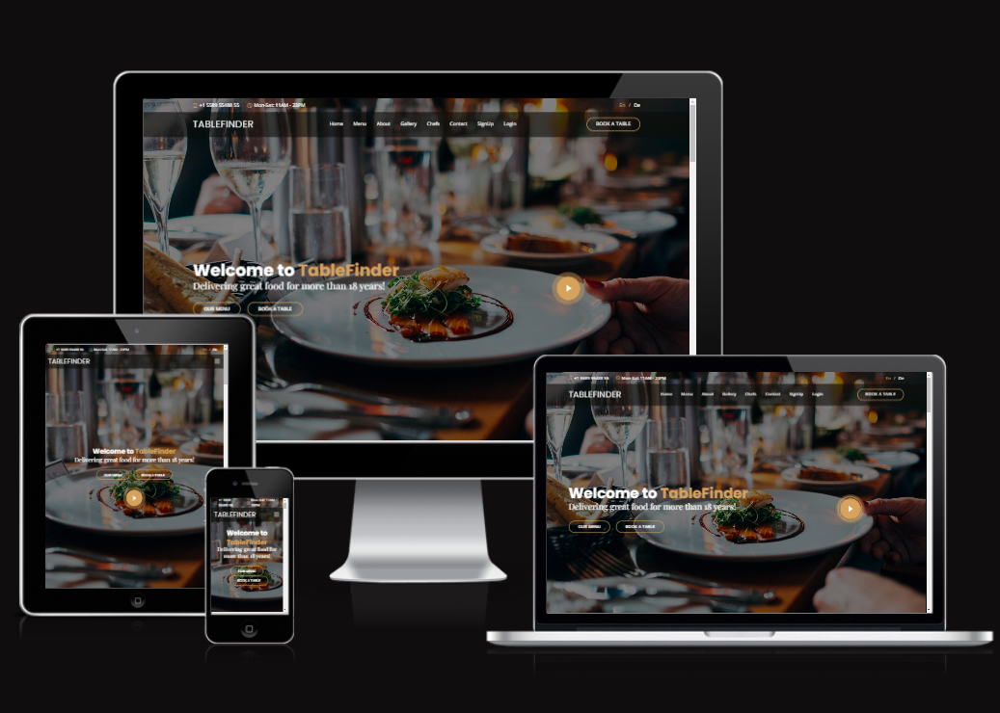

 

#### This is a web application designed to help restaurant customers find their ideal dining experience in New York.As the fourth project in the Code Institute Full Stack Developer program, TableFinder provides a user-friendly platform for  customers to discover great food and a cool atmosphere while hanging out with friends or family.

#### Our website features a sleek and modern design, highlighting the unique interiors and atmospheres of each restaurant we   showcase. Additionally, TableFinder includes an intuitive account registration and booking system, allowing customers to make and manage their reservations directly through our platform.Whether you're a local or just visiting, TableFinder is the perfect resource for finding your next favorite dining spot in the city. Join us and discover what New York's vibrant food scene has to offer!

 

[View the live project here](https://tablefinder.herokuapp.com/)

 

   - [User Experience (UX)](https://github.com/SuzanDewitz/TableFinder#user-experience-ux)
      - [Project goals](https://github.com/SuzanDewitz/TableFinder#project-goals)
      - [User Stories](https://github.com/SuzanDewitz/TableFinder#user-stories)
      - [Agile Methodology](https://github.com/SuzanDewitz/TableFinder#agile-methodology)
      - [Design](https://github.com/SuzanDewitz/TableFinder#design)
        - [Wireframes](https://github.com/SuzanDewitz/TableFinder#wireframes)
        - [Database Schema](https://github.com/SuzanDewitz/TableFinder#database-schema)
   - [Features](https://github.com/SuzanDewitz/TableFinder#features)
        - [Future Features](https://github.com/SuzanDewitz/TableFinder#future-features)
        - [Responsive Design](https://github.com/SuzanDewitz/TableFinder#responsive-design)
   - [Technologies](https://github.com/SuzanDewitz/TableFinder#technologies)
       - [Languages](https://github.com/SuzanDewitz/TableFinder#languages)
       - [Frameworks-Libraries-Programs](https://github.com/SuzanDewitz/TableFinder#frameworks-libraries-programs)
       - [Tools](https://github.com/SuzanDewitz/TableFinder#tools)
  - [Testing](https://github.com/SuzanDewitz/TableFinder#testing)
      - [Bugs](https://github.com/SuzanDewitz/TableFinder#bugs)
      - [Fixed Bugs](https://github.com/SuzanDewitz/TableFinder#fixed-bugs)
      - [Remaining Bugs](https://github.com/SuzanDewitz/TableFinder#remaining-bugs)
  - [Deployment](https://www.heroku.com/)
    - [Forking the GitHub Repository](https://github.com/SuzanDewitz/TableFinder#forking-the-github-repository)
    - [Running the project locally](https://github.com/SuzanDewitz/TableFinder#running-the-project-locally)
    - [Deploying with Heroku](https://github.com/SuzanDewitz/TableFinder#deploying-with-heroku)

- [Credits](https://github.com/SuzanDewitz/TableFinder#credits)
    + [Code](https://github.com/SuzanDewitz/TableFinder#code)
    + [Inspiration](https://github.com/SuzanDewitz/TableFinder#inspiration)
    + [Content](https://github.com/SuzanDewitz/TableFinder#content)
    + [Media](https://github.com/SuzanDewitz/TableFinder#media)
    + [Inspiration](https://github.com/SuzanDewitz/TableFinder#inspiration)
    + [Acknowledgments](https://github.com/SuzanDewitz/TableFinder#acknowledgments)

   
   

  # Portfolio Project 4 - TableFinder restaurant booking system
  
   

  # User Experience (UX)
   ## Project goals

The project goals are focused on creating an attractive and user-friendly restaurant webpage that aims to entice visitors and generate an interest in the restaurant. To achieve this goal, the website will be designed to provide visitors with general information about the restaurant, its menu offerings, and a seamless reservation system that allows them to book a table directly on the webpage.
 
 

By providing a user-friendly and intuitive booking system, the website aims to provide an excellent user experience and encourage visitors to make reservations quickly and easily.
 Additionally, the website will also provide a booking management admin panel for the staff members to help them manage the reservations more efficiently.
Overall, My project goals are aimed at providing an exceptional user experience to visitors and making the booking process easy and convenient for them. 

## User stories
  + First Time Visitor Goals
  + As a first-time visitor to the restaurant website, my goal is to learn about the restaurant's menu offerings, location, hours of operation, and contact information.
   I want to be able to navigate the website easily and find the information I need quickly. I also want to be able to make a reservation for a table directly on
    the webpage and have the option to view the restaurant's reviews and ratings.

   + As a first-time visitor, I want to learn about the restaurant's history and get a feel for the atmosphere and ambiance.
   + As a first-time visitor, I want to browse the menu and learn about the restaurant's food offerings.
   + As a first-time visitor, I want to be able to make a reservation for a table directly on the webpage.

+ Returning Visitor Goals

   + As a returning visitor to the restaurant website, my goal is to quickly access the reservation system and make a reservation for a table. I also want to be able to view any updates or changes to the menu offerings and find information on any upcoming events or promotions. I want the website to remember my previous visit and provide personalized recommendations based on my preferences.

+ Admin/Staff Goals

   + As an admin or staff member, my goal is to efficiently manage the restaurant's bookings and reservations using the admin panel provided. I want to be able to view and manage upcoming reservations, update the restaurant's availability, and manage the customer database. I also want to be able to receive notifications and alerts for any new reservations or changes to existing bookings.

+ Frequent User Goals
     + As a frequent user of the restaurant website, I want to be able to easily access my account and view my past reservations.
     + As a frequent user, I want to be able to save my favorite menu items and view recommendations based on my preferences.
     + As a frequent user, I want to be able to earn rewards or loyalty points for my visits and reservations.
     + As a frequent user, I want to be able to provide feedback and reviews on my dining experience to help improve the restaurant's service and offerings.

## Agile methodology
  + The restaurant webpage project will follow the Agile methodology, which is a flexible and iterative approach to software development. This methodology emphasizes collaboration, communication, and adaptability to changing requirements.

     +  With Agile, we will break down the project into smaller, more manageable tasks and prioritize them based on their importance and value to the end-users. We will also work in short, time-boxed iterations (usually called "sprints") to continuously deliver functional and tested features.

    + To ensure effective collaboration and communication, To hold daily stand-up meetings to discuss progress, identify any roadblocks, and plan the next steps. Also regularly engage with the stakeholders (including restaurant owners and staff) to get their feedback and incorporate their input into the project.

     + By using the Agile methodology, we can ensure that our project stays on track and meets the needs of the stakeholders. It also allows us to be more responsive to changing requirements or priorities, and to continuously improve the project based on feedback and testing.

## Design
  + The restaurant webpage project will be designed with a focus on user experience and visual appeal. We aim to create an inviting and seamless experience for visitors that showcases the   restaurant's unique personality and offerings. 

     + To achieve this, we will use a clean and modern design aesthetic that reflects the restaurant's brand identity. Also prioritize ease of navigation and accessibility, ensuring that visitors can easily find the information they need and make a reservation with minimal effort.

    + The design process will involve creating wireframes and prototypes to test the usability and effectiveness of our design choices. Also incorporate user feedback throughout the design process to ensure that the final product meets the needs and expectations of our target audience.

     + In addition to the visual design, Also ensure that the website is optimized for performance and accessibility. This includes using responsive design techniques to ensure that the website is functional and user-friendly on a variety of devices, and adhering to web accessibility guidelines to ensure that the website can be used by people with disabilities.

     + By prioritizing design and user experience, we aim to create a restaurant webpage that stands out from the competition and delivers an exceptional experience for our visitors.
<b>
<b>

[Back to top](#top)

<b>
<b>

+ Colors and Fonts:
    + Our restaurant webpage project will use a color scheme and font selection that reflect the restaurant's brand identity and evoke an elegant and upscale atmosphere.
     The main color used throughout the website will be black, which provides a classic and timeless feel. This color will be used as the background for the website, 
     providing a neutral and elegant canvas for the content to stand out.

    + To add a touch of sophistication and luxury, we will use gold accents for elements such as buttons, icons, symbols, links, and headings. This color choice complements the black background and enhances the premium look and feel of the webpage.

     + In terms of fonts, we will use clear and modern fonts that are easy to read and contribute to the overall elegant setting. The font selection will reflect the restaurant's brand identity and add to the overall cohesiveness of the design.

+ Images
  + The images used in the theme will be carefully curated to provide great content and presentation of the restaurant. They will serve as an enticement for the visitors
    and showcase the restaurant's unique personality and offerings. We will also ensure that the images are optimized for performance and accessibility, to ensure that they 
    load quickly and can be viewed by a wide range of users.By using a cohesive color scheme, font selection, and image curation, we aim to create a visually appealing 
    and engaging restaurant webpage that captures the attention of our visitors and reflects the restaurant's brand identity.

## Wireframes

  + Wireframes are an essential tool that allows designers and stakeholders to visualize and refine the website's structure and functionality before the actual design process begins.
    They provide a blueprint for the website's layout and content, enabling early feedback and iterations to ensure that the final product meets the project's objectives and user
     needs For the restaurant webpage project. 
  + The wireframes for the homepage show the layout and placement of key elements such as the logo, navigation menu, reservation page, about us page, and contact page, Gallery pages,
     Mybookings page, Booking a table pages, Delete page, and featured images. 
  + The wireframes for the menu page show the organization of the menu items, pricing, and images. The wireframes for the reservation page show the form fields and steps required to
    make a reservation. The wireframes for the about the page show the layout of the content and images that provide information about the restaurant's history, team, and mission. 
  + The wireframes for the contact page show contact information for visitors to get in touch with the restaurant.These wireframes have been created with a focus on user experience, 
    ensuring that the website is easy to navigate, visually appealing, and provides the necessary information for visitors to make reservations and learn about the restaurant. 
    Once the wireframes have been approved, I moved on to the design process,using these wireframes as a foundation for the final design.
   
 
   
   + [For Desktop view](./docs/WIREFRAMES.md)
 
   + [For Mobile view](./docs/WIREFRAMES_mobile.md)

 
   
## Database Schema
### Orders Table  
+ The database design schema for our restaurant booking system can be viewed below. It consists of a Booking model that stores information about the reservations made by customers,
  including the date and time of the reservation, the number of guests, and the table number. The Booking model has a foreign key that relates to the Django standard User model class,
   which stores information about the registered users who made the reservation. This allows us to associate each reservation with the user who made it.

 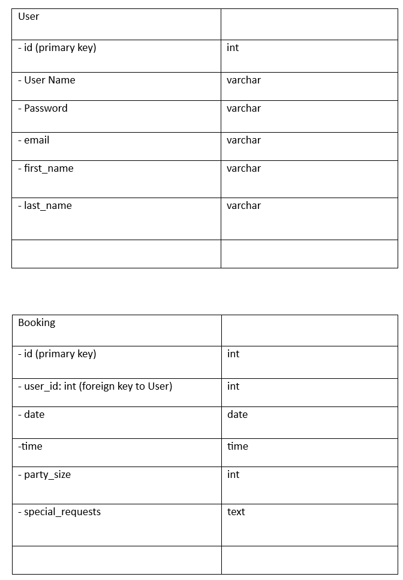

 
   
## Features
   
## Navbar 
+ The website's navbar displays all the available sections and provides convenient navigation for users. The "Make a Booking" link is prominently displayed and 
enlarged for easy access, ensuring a seamless booking experience.

 

   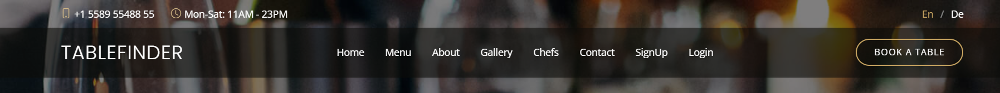 

 
   
 ## Hero  
   
 + The hero section is the first thing visitors see when they land on the site, so it's crucial to make a strong impression. It prominently features links to the menu
  and reservation pages, which are likely to be the most important sections for users. Additionally, there's a video presentation that showcases the restaurant and helps 
  to further engage visitors. Overall, the hero section serves as an effective introduction to the restaurant and encourages visitors to explore the site further.  
 

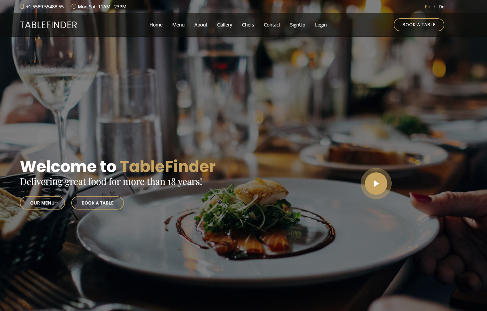 

 

## Menu
+ The Menu section showcases the wide range of dining options available at our restaurant, complete with enticing images and detailed descriptions.With the added functionality 
  to filter options by meal type, customers can easily find the perfect dish to satisfy their cravings.
+ In the Menu section, customers can explore the diverse selection of dishes offered at our restaurant, each accompanied by mouth-watering images and comprehensive descriptions. 
  The user-friendly filtering system allows for effortless navigation, making it easy to find and order the perfect meal.Our Menu section provides a visual feast for customers,
   with vivid images and enticing descriptions of our entire menu. Whether you're in the mood for breakfast, lunch, or dinner, the user-friendly filtering feature ensures that you can quickly and easily find your desired meal.

 
   
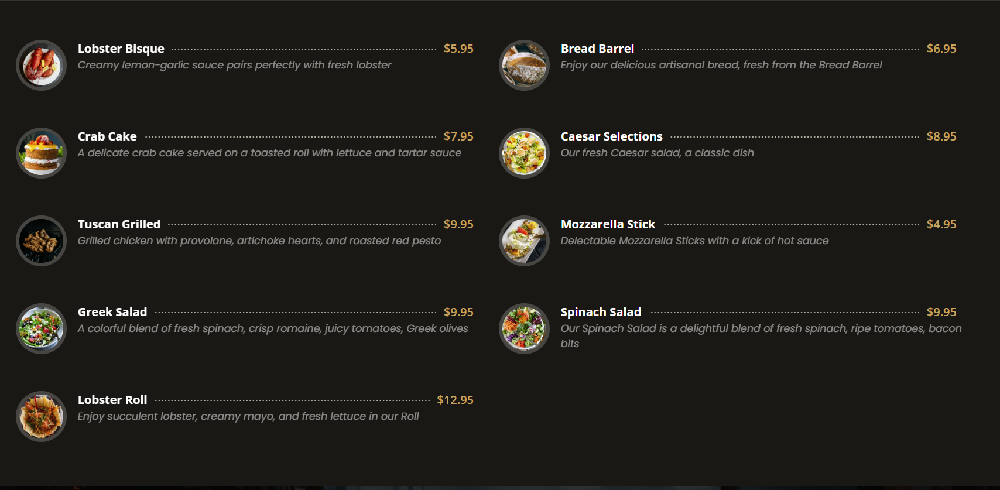 

  
   
  ## About 
 + The About section provides a glimpse into the history and personality of the restaurant. Visitors can learn about the restaurant's founding, its values, and its unique features,
 such as its commitment to using locally sourced ingredients or its focus on sustainable practices. The section also includes photos and descriptions of the restaurant's 
 interior and ambiance, giving visitors a sense of what to expect when dining there.
   
 

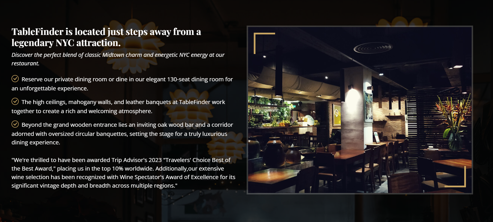

 
   
 ## Testimonials
  + The testimonials section is a powerful tool for showcasing the positive experiences of previous customers, adding credibility and social proof to the restaurant's reputation.
   By sharing personal accounts of their experiences, it can help increase customer confidence and encourage bookings or visits to the restaurant.
   
 

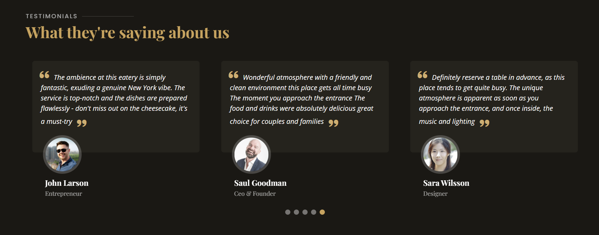

 

## Gallery
  + Our restaurant boasts an inviting and cozy interior, and our gallery provides a glimpse into the ambiance and atmosphere that awaits you. 
  Browse through our collection of images to get an idea of what you can expect when you visit us

 

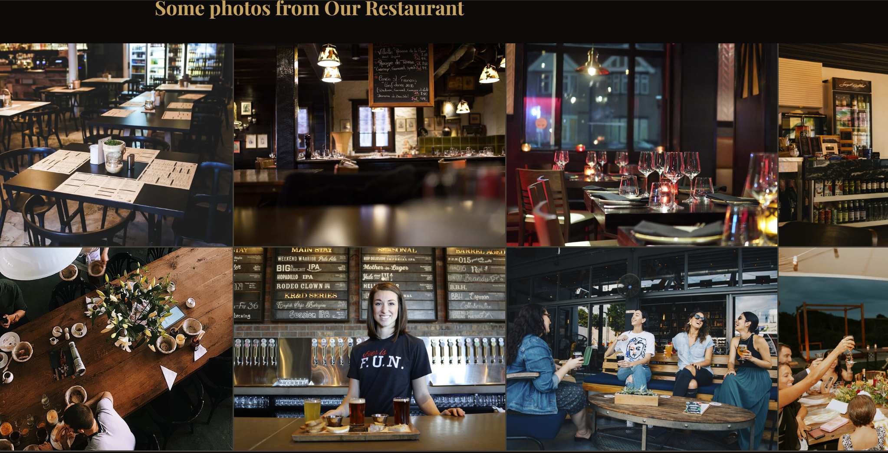

  

## Contact
  + The Contact section provides essential information about the restaurant, such as its address, phone number, email address, and social media links, to make it easier 
  for customers to get in touch and ask any questions or make reservations. This section serves the purpose of facilitating communication between the restaurant and its customers. 
  Additionally, specific features of the Contact section, such as a contact form or interactive map, can also be mentioned to further enhance the user experience.

 

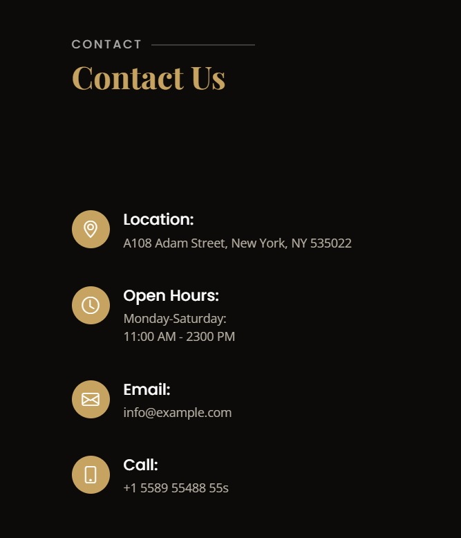

 

## Account signup/login
  + The Account Signup/Login section allows users to create an account and login to the website. This feature can be beneficial for returning customers, as they can save their information 
   and make reservations more quickly in the future. Additionally, the Account Signup/Login section can provide the restaurant with valuable customer data, such as email addresses and 
   preferences, which can be used for marketing and customer service purposes.

 

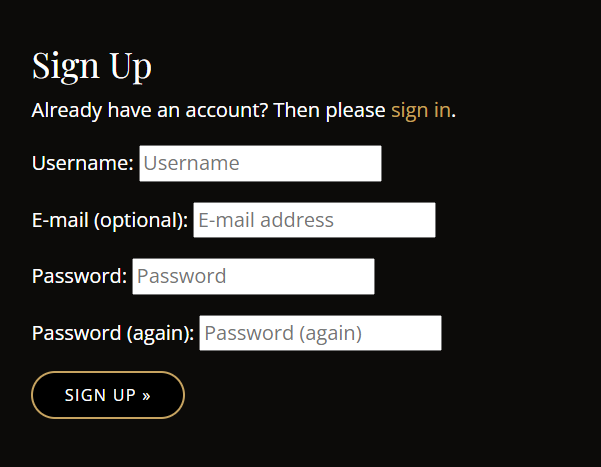
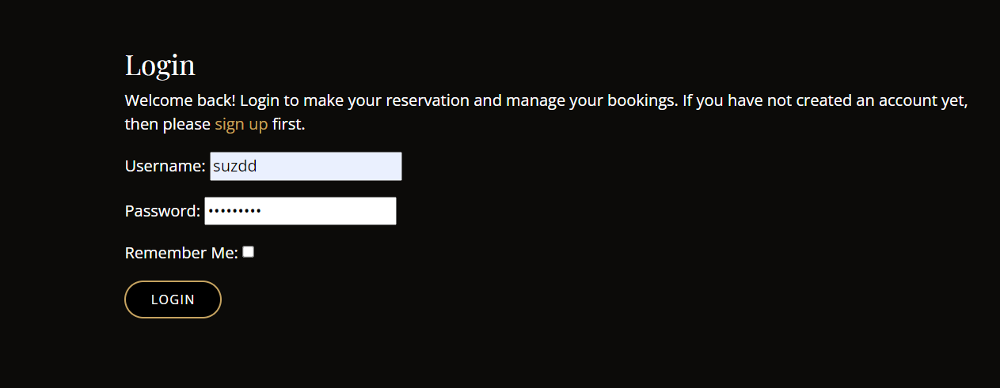

 

## Booking page
  + The booking page is a crucial feature of the website, allowing customers to easily make reservations online. Visitors can select the date and time they want to reserve a table for,
   specify the number of people in their party, and make any special requests they may have. The booking page is designed to be user-friendly and intuitive, providing a quick and effortless booking experience for customers.Customers can also log in to their account to view their booking history, make changes to their upcoming reservations, and cancel if necessary. 
  + This feature makes it easier for customers to manage their reservations and ensure that everything is in order.In addition to the booking form, the Booking page 
   may feature helpful information, such as available dates and times, as well as any special promotions or deals currently available. Once a reservation is submitted, 
   it is saved and can be viewed by the customer in their personal My Bookings page, making it easy to keep track of their reservations.
   Overall, the Booking page is an essential component of the Tablefinder Restaurant website, making the process of reserving a table quick and effortless for customers.

 

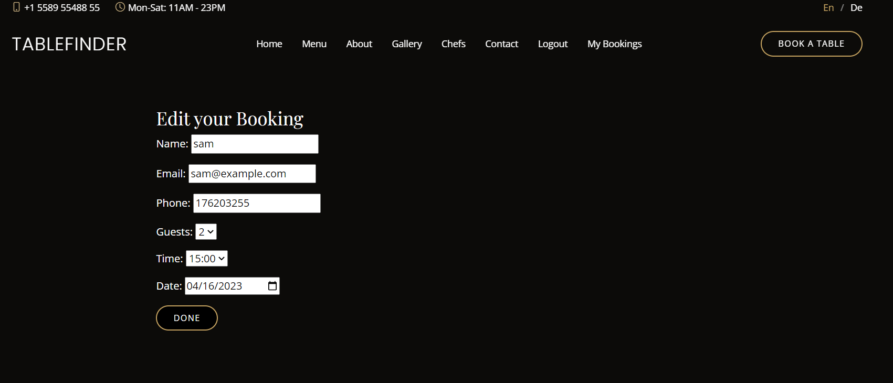

 

## Mybookings
  + The Mybookings page is an essential part of the website. It provides customers with a clear overview of their current and past reservations.
    Visitors can quickly and easily access their booking details, including the date, time, and number of guests, in a single location. 
  + The Mybookings page is designed to be intuitive and user-friendly, allowing customers to easily manage their reservations. In addition to viewing their current bookings,
    customers can also make changes to their reservations directly from the Mybookings page. By clicking on the "change" button, customers can update their reservation details,
     such as the date, time, or number of guests. 
   + Once the changes are saved, the updated information will be displayed on the Mybookings page.Moreover, the Mybookings page provides customers with the ability 
    to delete a reservation if necessary. By clicking on the "delete" button, customers can remove a booking from their list of reservations. This feature makes it easy for
    customers to cancel a reservation they no longer need, freeing up space for other diners.Overall, the Mybookings page is a convenient and user-friendly way for customers to manage their reservations at Tablefinder Restaurant.

 

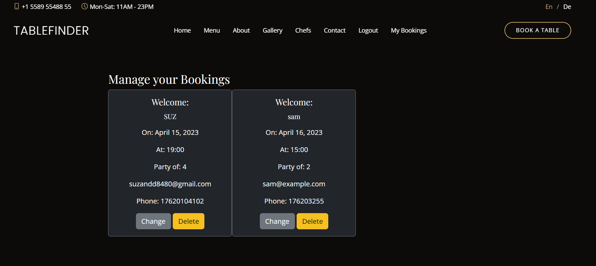

 

## Delete booking
 + The "delete" function on the mybookings page is an important feature. When a customer clicks on the "delete" button, a warning message is displayed to ensure that the customer doesn't accidentally delete a booking. This helps to prevent any confusion or misunderstandings that may arise from accidentally deleting a reservation. Once the customer confirms the deletion, the reservation will be removed from the mybookings page, giving the customer a clear and updated overview of their upcoming reservations. Overall, the delete function provides a simple and effective way for customers to manage their reservations and ensure that their booking information is accurate and up-to-date.

 

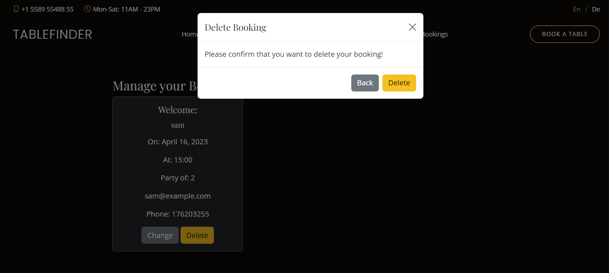

 

## Footer 
  + The footer is an important section that appears at the bottom of each page. It contains essential information about the restaurant, including contact information such as the address, phone number, and email address. In addition, the footer may also include links to the restaurant's social media profiles, making it easy for customers to follow and stay updated on the latest news and promotions.

  + The footer is designed to be easily accessible and provide quick access to the most relevant information, no matter which page the visitor is on. This ensures that customers can easily find the information they need, whether they are browsing the menu or making a reservation. Additionally, the footer may also include legal information such as terms and conditions, privacy policy, and copyright information to ensure that visitors are informed and protected while using the website.

 

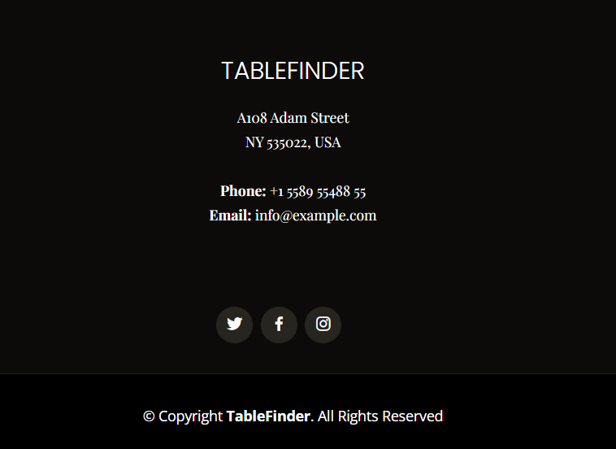

 

## Future Features
  + In the future, there are several features that could be added to enhance the functionality of the website. One such feature is to implement a system that checks for overbooking, preventing customers from making a reservation if the restaurant is already full. Additionally, a contact form could be added to the main page to allow visitors to contact the restaurant directly via email.

  + To create functionality within the admin panel that allows staff to add or delete tables and seats in the restaurant. This information could then be incorporated into the booking function, ensuring that the system can calculate the available seats in the restaurant accurately.

  + To add functionality to the admin panel so that restaurant personnel can easily update menu items on the webpage. This would streamline the process of keeping the website up-to-date with the latest menu offerings.

 

## Responsive design
 + I implemented responsive design to ensure that our website is accessible and easy to use across all devices. This means that the website is designed to adapt to different 
   screen sizes and resolutions, providing a seamless user experience for desktop and mobile users alike.

 + To ensure that the website functions optimally on all devices, I tested it using a multi-device emulator with different screen sizes in the Google Chrome Developer Dashboard. This has allowed  
   me to identify and address any issues that may arise on different devices.

 

## Technologies 
 ### Languages
   + HTML5
   + CSS3
   + Python
   + JavaScript

 

## Frameworks, Libraries, Programs
  + [Django](https://www.djangoproject.com/)python framework used to create all the backend

 

## Tools

 

  + [Postgresql](https://www.postgresql.org/): database used to store and manage data for the application. 
  + [Google Fonts](https://fonts.google.com/): Was used to to incorporate font styles.
  + [Gitpod](https://gitpod.io/workspaces)Gitpod was used as IDE to commit and push the project to GitHub..
  + [Bootstrap](https://getbootstrap.com/) Was used to create the front-end design.
  + [Github](https://github.com/) Was used for all storing and backup of the code pertaining to the project.
  + [Balsamiq](https://balsamiq.com/) Was used to create wireframes
  + [lucidchart](https://www.lucidchart.com/pages/) Was used to create the database schema.
  + [Am I Responsive ](https://ui.dev/amiresponsive)to generate an image showcasing the website's responsiveness to different screen sizes
  + [pip3](https://pypi.org/project/pip/) is the package manager to install Python modules and libraries.
  + [Gunicorn](https://docs.djangoproject.com/en/4.1/howto/deployment/wsgi/gunicorn/)"Green Unicorn" is a Python Web Server Gateway to translate HTTP Requests for Python to understand.
  + [psycopg2](https://pypi.org/project/psycopg2/2.9.3/) used to interact with PostgreSQL databases, which may be used in a Django restaurant booking system for executing SQL queries and  
     connecting to the database.
  + [Cloudinary](https://cloudinary.com/) the image hosting service used to upload images and other media.
  + [Heroku](https://dashboard.heroku.com/apps) the hosting service used to host the website
  + [VSCode](https://code.visualstudio.com/)the IDE used to develop the website.
  + [Chrome Developer Tools](https://developer.chrome.com/docs/devtools/open/) was used to debug the website.
  + [W3C Validator](https://validator.w3.org/)used to validate HTML5 code for the website.
  + [W3C CSS validator](https://jigsaw.w3.org/css-validator/)used to validate CSS code for the website.
  + [CI Python Linter](https://pep8ci.herokuapp.com/)used for static code analysis that checks Python code 

 

## Testing 
+ A separate document for testing can be viewed here: [TESTING.md](https://github.com/SuzanDewitz/TableFinder/blob/main/docs/TESTING.md)

+ A separate document for validator can be viewed here: [validator](https://github.com/SuzanDewitz/TableFinder/tree/main/docs/img/validator)

 

## Bugs

## HTML Validation
 + The [W3C Markup Validation](https://validator.w3.org/) Service was used to validate the HTML of the website
  
  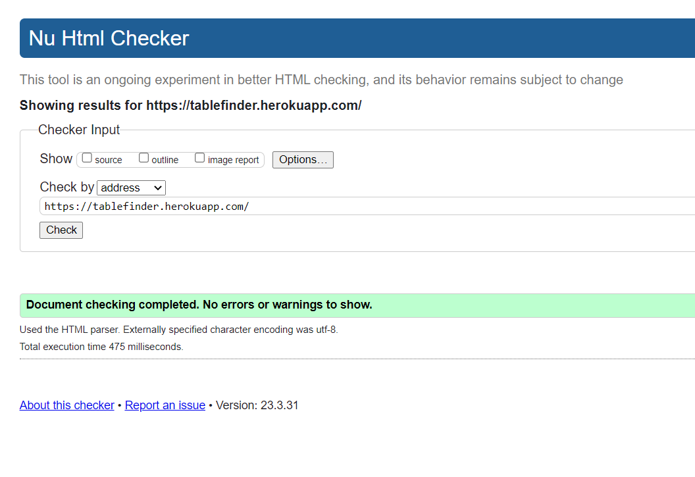

   

## CSS Validation:

The website CSS style has successfully passed the [W3C Jigsaw CSS Validation](https://jigsaw.w3.org/css-validator/).

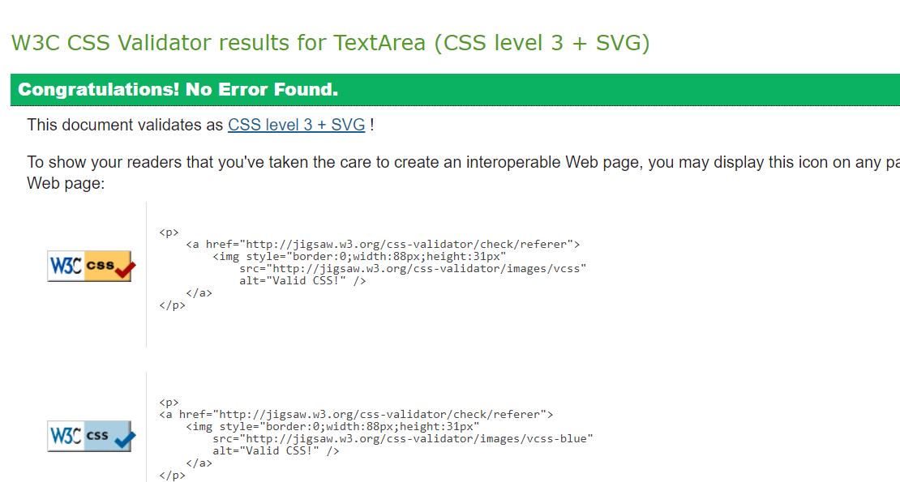

 

+ A separate document for Python Validation can be viewed here: [validator](https://github.com/SuzanDewitz/TableFinder/tree/main/docs/img/validator)
  ### Python Validation (PEP8)
   + All Python code was manually checked using [CI Python Linter](https://pep8ci.herokuapp.com/) The Linter reports had messages about exceeding 
     the string length of 79 characters, which have been fixed and blank lines. Re-testing did not reveal any errors.

  ### Fixed Bugs
   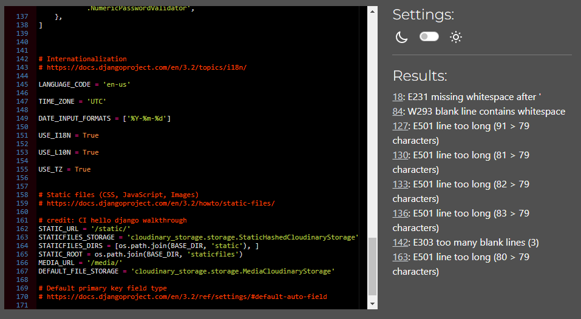

    

   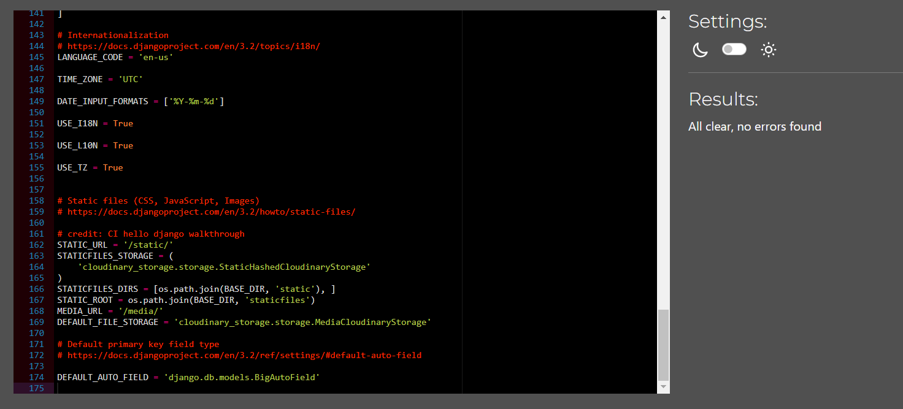

 

  ### Remaining Bugs
   + No known bugs remaining
 
 

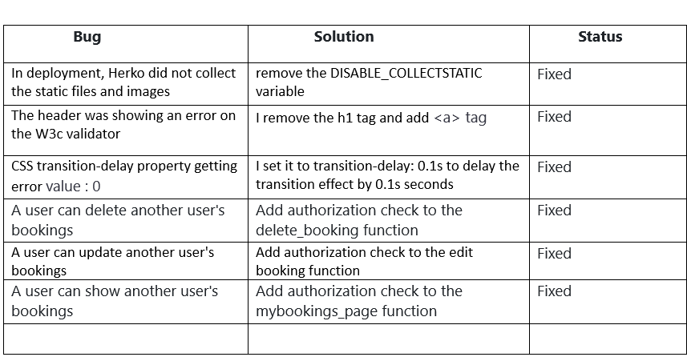

 
 

## Testing User Stories from User Experience (UX) Section
  1. Define the user stories: Begin by reviewing the user stories i have  created for the UX section of my project. Make sure that each user story is well-defined, and that it describes a specific user need or goal.

  2. Identify the acceptance criteria: For each user story, identify the acceptance criteria that must be met in order for the story to be considered complete. This might include specific user actions, system responses, or other criteria.

  3. Create test cases: Based on the acceptance criteria, create a set of test cases that will allow me to verify that the user story has been implemented correctly. These test by include manual testing, automated testing, and a combination of both.

  4. Perform the testing: Using the test cases i created, perform the testing to ensure that each user story has been implemented correctly. This might involve testing the user interface, interacting with the system, or reviewing the code to ensure that it meets the acceptance criteria.

  5. Document the results: As i perform the testing, document the results in a clear and concise manner. Be sure to note any issues or bugs that you encounter, and provide detailed information on how to reproduce them.

   
 

## Manual Testing

### Device Testing
 + The Project was tested using a multi-device emulator with different display sizes in the Google Chrome Developer Dashboard. The following devices have been tested:

   + Nest HubMax (Desktop)
   + iPad Pro (Tablet)
   + iPad Air (Tablet)
   + iPad Mini (Tablet)
   + Galaxy Tab S4 (Tablet)
   + Nexus 7 (Mobile)
   + Nokia N9 (Mobile)
   + iPhone 5/SE (Mobile)
   + iPhone 4 (Mobile)
   + Browsers Tested

    

#### Testing has been carried out on the following browsers:

  + Google Chrome
  + Firefox
  + Microsoft Edge
### The available functionality and user experience of the website as follows:

 

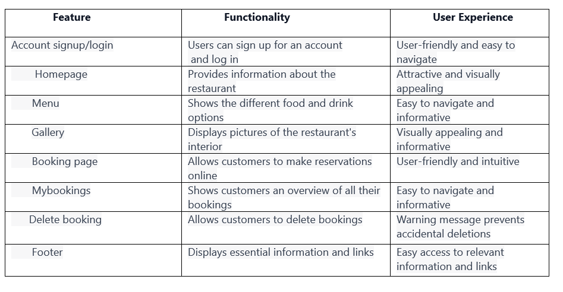

 

## Deployment

### Deploying with Heroku

I followed the below steps using the Code Institute walkthrough:

+ The following command in the Gitpod CLI will create the relevant files needed for Heroku to install your project dependencies pip3 freeze --local > requirements.txt. Please note this file should be added to a .gitignore file to prevent the file from being committed.

   1. Go to [Heroku.com](https://dashboard.heroku.com/) and log in; if you do not already have an account then you will need to create one.
   2. Click the New dropdown and select Create New App.
   3. Enter a name for your new project, all Heroku apps need to have a unique name, you will be prompted if you need to change it.
   4. Select the region you are working in.

### Heroku Settings
+ You will need to set your Environment Variables - this is a key step to ensuring your application is deployed properly.

  1. In the Settings tab, click on Reveal Config Vars and set the following variables:

     - Add key: PORT & value 8000
     - Add key: DATABASE_URL, this should have been created automatically by Heroku.
     - Add key: CLOUDINARY_URL and the value as your cloudinary API Environment variable e.g.
     - Add key: SECRET_KEY and the value as a complex string which will be used to provide cryptographic signing.
  2. Buildpacks are also required for proper deployment, simply click Add buildpack and search for the ones that you require.
     - For this project, I needed to add Python.

### Heroku Deployment

 

#### In the Deploy tab:

1. Connect your Heroku account to your Github Repository following these steps:
   - Click on the Deploy tab and choose Github-Connect to Github.
   - Enter the GitHub repository name and click on Search.
   - Choose the correct repository for your application and click on Connect.
2. I can then choose to deploy the project manually or automatically, automatic deployment will generate a new application every time you push a change to Github,
   whereas manual deployment requires you to push the Deploy Branch button whenever you want a change made.
3. Once you have chosen your deployment method and have clicked Deploy Branch your application will be built and you should now see the View button, click this to open your application.

 

## Forking the GitHub Repository

 

 To use this code and make changes without affecting the original code, it is possible to 'fork' the code on the GitHub repository through the following steps:

   1. Create or log into your GitHub account.
   2. Go to the GitHub [repository](https://github.com/SuzanDewitz/TableFinder).
   3. Click the 'Fork' button in the upper right-hand corner of the page. A copy of the repository will be available in your own repository.

 

## Making a Local Clone

1. Log in to GitHub and locate the GitHub Repository
2. Under the repository name choose button "Code", click "Clone or download".
3. To clone the repository using HTTPS, under "Clone with HTTPS", copy the link.
4. Open your development editor of choice and open a terminal window in a directory of your choice
Type git clone, and then paste the URL you copied in Step 3.
- > git clone https://github.com/YOUR-USERNAME/YOUR-REPOSITORY

+ Press Enter.

Your local clone will be created.

 

For more information follow this link.[Link](https://docs.github.com/en/repositories/creating-and-managing-repositories/cloning-a-repository#cloning-a-repository-to-github-desktop)

 
 

# Credits

## Code
  + Code Institute walkthrough as inspiration and code examples, the [code institute](https://codeinstitute.net/de/)walkthroughs "Hello Django" and "I Think Therefore I Blog" was used.
  + [Restaurantly Boostrap theme](https://bootstrapmade.com/restaurantly-restaurant-template/)was the Boostrap theme used in the project.
  + [Django Documenation](https://docs.djangoproject.com/en/4.1/ref/)was used to provide examples of code solutions and Django functionality.
  + [Digital Restaurant YouTube](https://youtu.be/6y58yyGnNoE)

 

 ## Inspiration 
 + My goal is creating the Restaurant Booking System was to build a high-quality, user-friendly platform that would streamline the process of making restaurant reservations. 
   I drew inspiration from several sources, including:
   - The Hello Django project
   - The I Think Therefore I Blog project
   - The user experience and design aesthetic of popular reservation systems like OpenTable and Resy
   - The latest trends in web development, including responsive design and real-time updates
   - The open-source community and the many resources available for building scalable web applications
 + The system would meet the needs of both parties. By leveraging these sources of inspiration,I aimed to create a best-in-class platform that would make
   restaurant bookings easier and more enjoyable for everyone involved.

 

# Content

   + The restaurant booking system is built entirely with Bootstrap, a popular front-end web development framework. I used Bootstrap's pre-designed components
     and templates to create a visually appealing and user-friendly interface for the customers.

   + By leveraging Bootstrap's powerful CSS and JavaScript components, I were able to create a cohesive design language across the entire website. 
     This helped to ensure that the user experience is consistent and intuitive, regardless of which page the user is on.

   + Additionally, I customized certain aspects of the design to fit the specific branding and content needs. For example, 
    I used Bootstrap's form components to create a reservation form that seamlessly integrates into the overall design of the website.

   + "I found that using Bootstrap allowed me to create a high-quality and professional-looking restaurant booking system in a fraction of the time it would have taken to
    develop from scratch. By utilizing the pre-built components and responsive design of Bootstrap, I was able to focus on the functionality and user experience of the system, 
    ultimately delivering a product that exceeded our client's expectations."

 

## Media
  + The images in the project comes from the[Restaurantly Boostrap theme](https://bootstrapmade.com/restaurantly-restaurant-template/)
  + The video in the project comes from the[Restaurantly Boostrap theme](https://bootstrapmade.com/restaurantly-restaurant-template/)

 

## Acknowledgments
  + I would like to extend my gratitude to my Code Institute mentor, Daisy Mc Girr, for her feedback and helpful suggestions.
  + I would like to acknowledge the tutor support team at Code Institute for their valuable support throughout the course.
  + The Code Institute Slack community for their invaluable assistance and support throughout the course.
  + I would like to extend my deepest appreciation to my husband, <a href="#" style="color: blue; text-decoration: none;">Deitmar Dewitz</a>, for his unwavering support, encouragement, and guidance throughout the development of all my projects. His advanced knowledge and expertise were instrumental in helping me overcome numerous technical challenges. Without his invaluable feedback and patience, these projects would not have been possible.

  + I would also like to express my sincere gratitude to <a href="#" style="color: blue; text-decoration: none;">Praveen Kasam</a>, one of my husband's colleagues, for his time and effort in reviewing my projects. His feedback and suggestions were critical in shaping the final products. His expertise and critical evaluation helped me identify and fix issues that I would have otherwise missed.

  + I am grateful that both my husband and Praveen Kasam have been integral parts of all my projects, from the first to the third. Their unwavering support and guidance have been the backbone of these projects, and I am thankful for their constant encouragement and assistance.

 

[Back to top](#top)

